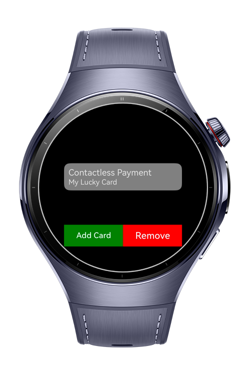
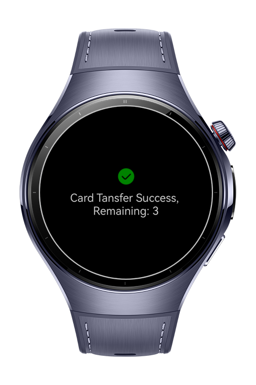
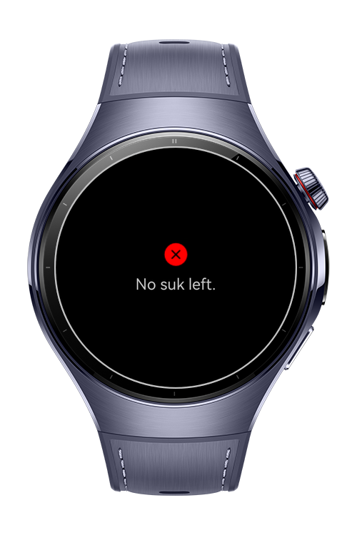

> **Note:** To access all shared projects, get information about environment setup, and view other guides, please visit [Explore-In-HMOS-Wearable Index](https://github.com/Explore-In-HMOS-Wearable/hmos-index).

# HcePayment

This app shows how to implement hce payment feature.

# Preview

<div>
  
  
  
  
</div>

# Use Cases

- Use NFC to make payments, both when the app is open and when it's closed.

# Technology

## Stack

- **Languages**: ArkTS, ArkUI
- **Frameworks**: HarmonyOS SDK 5.1.0(18)
- **Tools**: DevEco Studio Version 5.1.1.830
- **Libraries**:
    - @kit.ArkData
    - @kit.ConnectivityKit

## Required Permissions

- `ohos.permission.NFC_CARD_EMULATION`
  > To make payment

# Directory Structure

```
entry/src/main/ets/
├───components
│       CardTransferSuccess.ets
│       NoSuk.ets
├───entryability
│       EntryAbility.ets
├───entrybackupability
│       EntryBackupAbility.ets
├───model
│       Card.ets
│       SUK.ets
├───pages
│       Index.ets
├───rdb
│   │   Rdb.ets
│   └───tables
│           CardTable.ets
│           SukTable.ets
├───util
│       HceHandler.ets
└───viewmodel
        CardVM.ets
```

# Constraints and Restrictions

## Supported Device

* Huawei Watch 5

# License

**HcePayment** is distributed under the terms of the MIT License
See the [LICENSE](./LICENSE) for more information.